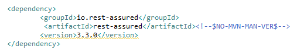
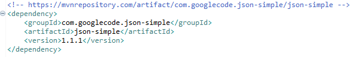
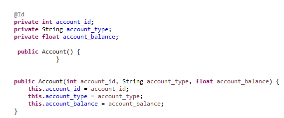
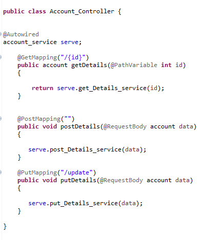
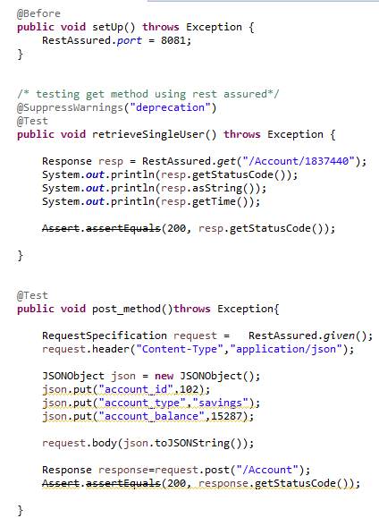
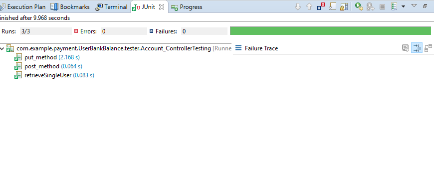

# REST API Testing Using Rest-Assured
Rest-Assured is a Java-based library that is used to test RESTful Web Services. This library behaves like a headless Client to access REST web services. We can create highly customize-able HTTP Requests to send to the Restful server.

### Maven Dependencies
In order to make use of Rest-Assured in a Maven project, the following dependency needs to be included in the POM:

For using JSON Object during test the following dependency needs to be included:

### Configuration

We'll now look at how we can integrate Rest-Assured in a Spring Micro service application. The first step is to create a Spring Boot application. Then we'll create a Spring REST service in the Boot application and write the Rest-Assured test for this REST Service.

#### 1.Rest Controller

As a first step let us create a controller class for simple CRUD operation on model Account :

**Account.java:**

**REST APIs for performing CRUD Operation: **

#### 2. Testing Class

First of all we need to mention our port number then for putting data in our payload in JSON format we use JSON Object.

### Testing APIs

Inorder to test you need to run the CucumberTest.java class as JUnit Case. Note your application should run at mentioned port before testing your application.

 

